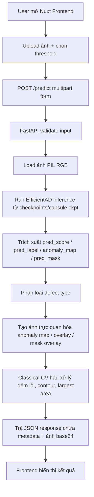
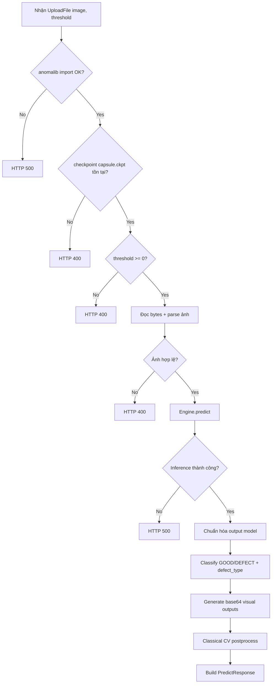

# System Pipeline

Tài liệu này mô tả pipeline xử lý của hệ thống EfficientAD Web App.

## 1. Luồng tổng quan

## 2. Chi tiết backend `/predict`

## 3. Thành phần chính trong pipeline

- Frontend: Nuxt (thư mục `web/`) gửi request và render kết quả.
- API layer: FastAPI trong `app.py`.
- Model inference: `anomalib` + `EfficientAdModelSize.M`, cố định model `capsule`.
- Defect type classification:
- `hash-based lookup` nếu ảnh trùng tập mẫu `test_img/`.
- fallback `feature similarity` nếu không trùng hash.
- Classical CV: `postprocess_anomaly_map`, `draw_contours_on_image` trong `classical_cv_utils.py`.
- Output: JSON gồm nhãn, score, số lỗi, diện tích lỗi lớn nhất và các ảnh base64.

## 4. I/O contract của endpoint chính

- Input: `POST /predict` (multipart form)
- `image`: file ảnh
- `threshold`: số thực (>= 0)
- Output: `PredictResponse`
- `label`, `defect_type`, `defect_confidence`, `score`, `pred_label`
- `anomaly_map_base64`, `anomaly_overlay_base64`, `pred_mask_overlay_base64`
- `defect_count`, `largest_defect_area`, `classical_overlay_base64`

## 5. Ghi chú vận hành

- Hệ thống đang khóa model về `capsule` trong logic backend.
- Checkpoint bắt buộc: `checkpoints/capsule.ckpt`.
- API phụ trợ:
- `GET /health` kiểm tra trạng thái import model stack.
- `GET /models` trả thông tin model/checkpoint khả dụng.
